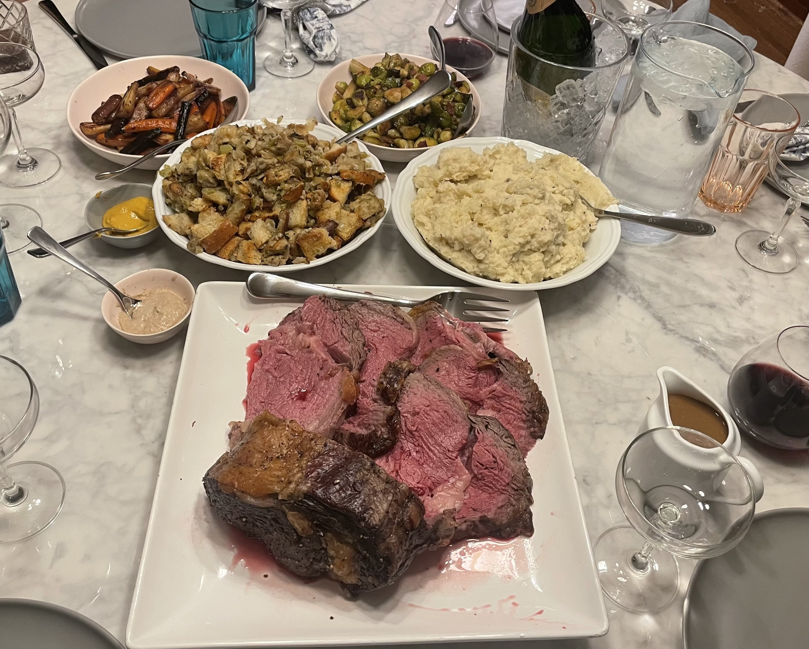

# Cooking

In my free time, I love getting creative in the kitchen. Since starting university, I've come to realize that eating well really starts with cooking well, so I've been putting effort into improving my skills. 

Here are a few of my favorite dishes I've made:

**Duck with cherry port sauce, crispy potatoes and roastedbrussel sprouts**

**Apple Crème Fraîche Pie**

**Christmas dinner with prime rib, stuffing, honey roasted carrots, mashed potatoes, brussel sprouts and gravy**
