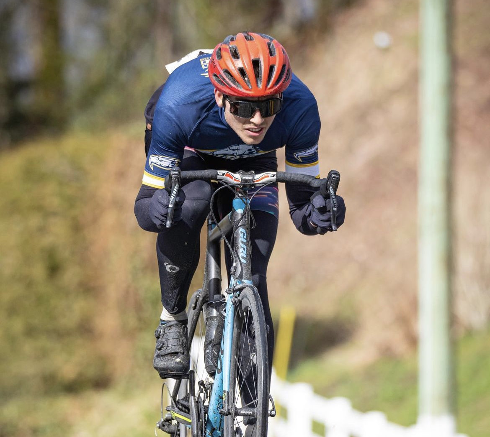

# Cycling   

Since COVID in 2020, I've developed a real passion for everything cycling.

In 2021 I tried out for the UBC cycling team and won a place on the team. I trained as a part of the team over the winter and raced during the spring. Being on the team pushed me to my limits and gave me new goals to work toward. As a member of the team I was awarded the Academic Thunderbird Award for maintaining high performance both on and off the competitive field.

In 2022 I rode with the Glotmann Simpson cycling group. Additionally, in the summer of 2023 I also purchased my first XC bike. I plan to take part in some XC races in Montreal in the summer of 2024!

**Me racing the 2021 Thornhill Circuit Race**

